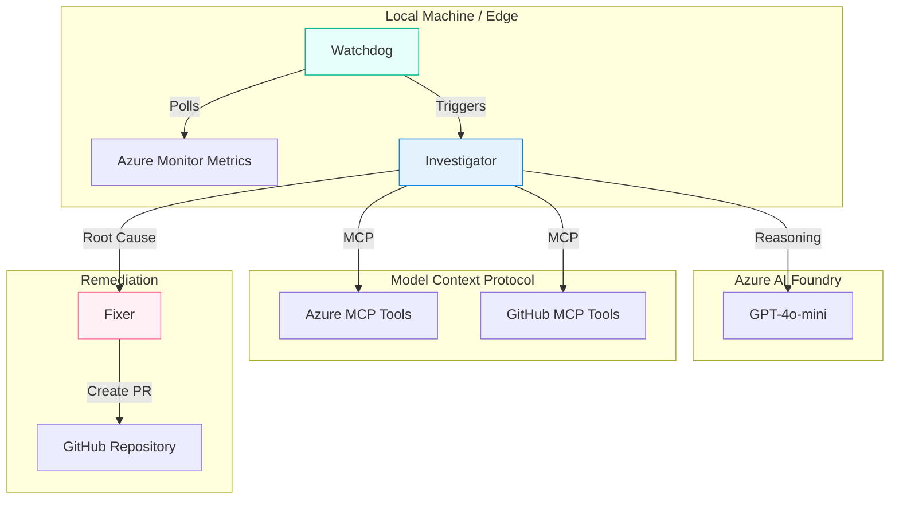

# Agent 200: Autonomous SRE with Tiered Intelligence


**Turning 500 Internal Server Errors into 200 OKs automatically.**

## The Problem
Modern cloud observability is expensive and noisy. Small teams and solo developers cannot afford enterprise SRE agents (costing $4+/hour) or DataDog subscriptions just to monitor a side project. When an incident occurs, the context switching between Azure Portal logs, GitHub Actions failures, and code editors delays remediation.

## The Solution
Agent 200 is a "Local-First" Autonomous SRE agent that runs on your own hardware (or free-tier compute). It uses a Tiered Intelligence architecture to monitor, diagnose, and fix infrastructure issues at near-zero cost.

Instead of sending terabytes of logs to a central cloud (expensive), Agent 200 brings the AI to the data source.

### Key Features

**Tier 1: Zero-Cost Watchdog**
*   Runs locally using Phi-3-mini.
*   Polls Azure Monitor metrics 24/7 for free.
*   Only wakes up the "expensive" cloud agent when an anomaly is detected.

**Tier 2: Cloud Investigator**
*   Powered by Azure OpenAI (GPT-4o-mini).
*   Connects to Azure MCP to read live metrics and resource health.
*   Connects to GitHub MCP to read CI/CD build logs and commit history.

**Tier 3: The Fixer**
*   Correlates the infrastructure failure with the specific code commit.
*   Drafts a Pull Request with the fix using GitHub Copilot Agent Mode.

## Architecture



## Getting Started

### Prerequisites
*   [.NET 9.0 SDK](https://dotnet.microsoft.com/download/dotnet/9.0)
*   [Node.js](https://nodejs.org/) (for MCP Servers)
*   Azure Subscription (Free Tier works)
*   GitHub Account

### Installation

1.  **Clone the repository**
    ```bash
    git clone https://github.com/YOUR_USERNAME/agent-200.git
    cd agent-200
    ```

2.  **Install MCP Servers**
    ```bash
    npm install -g @azure/mcp
    ```

3.  **Configure Secrets**
    *   Do not commit keys! Use User Secrets for the Host project.
    ```bash
    cd src/Agent200.Host
    dotnet user-secrets init
    dotnet user-secrets set "AzureOpenAI:Endpoint" "https://YOUR_RES.openai.azure.com/"
    dotnet user-secrets set "AzureOpenAI:Key" "YOUR_KEY"
    dotnet user-secrets set "AzureOpenAI:Deployment" "gpt-4o-mini"
    ```

4.  **Run the Agent**
    ```bash
    dotnet run
    ```

## Usage Example

**Scenario:** A deployment failed 5 minutes ago.

1.  **Watchdog** detects `HTTP 500` spike on `app-service-prod`.
2.  **Agent 200** wakes up and queries Azure MCP: *"What changed in the last 10 minutes?"*
3.  **Azure MCP** reports: *"Resource health is degraded. Last deployment failed."*
4.  **Agent 200** queries GitHub MCP: *"Get logs for the last failed run."*
5.  **Agent 200** identifies: *"Error: NullReferenceException in UserService.cs line 42."*
6.  **Agent 200** proposes a fix: *"Apply null check to UserService.cs."*

## Built With
*   **Orchestration:** [Microsoft Agent Framework](https://github.com/microsoft/agent-framework)
*   **Language:** C# / .NET 9
*   **Connectivity:** [Model Context Protocol (MCP)](https://modelcontextprotocol.io/)
*   **AI Models:** Azure OpenAI (GPT-4o-mini), Phi-3
*   **Infrastructure:** Azure Container Apps

## Contributing
This is a hackathon project, but contributions are welcome! Please read [CONTRIBUTING.md](CONTRIBUTING.md) for details on our code of conduct and the process for submitting pull requests.

## License
This project is licensed under the MIT License - see the [LICENSE](LICENSE) file for details.
